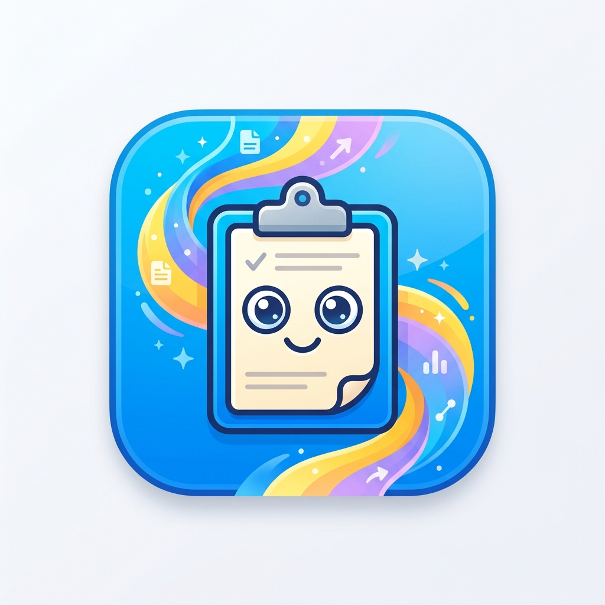

#  ClipFlow

[](https://github.com/Udean777/ClipFlow/actions/workflows/build.yml)
[](https://developer.apple.com/macos/)
[](https://swift.org)
[](https://developer.apple.com/xcode/swiftui/)

> A sleek, high-performance, and modern macOS clipboard manager. Designed to float seamlessly in your menu bar and optimize your daily workflow.

<p align="center">
  
</p>

---

## ✨ Features

- **⚡ Lightweight & Fast**: Built natively with Swift and SwiftUI for the ultimate performance and negligible resource footprint.
- **🗄️ Local Persistence**: Leverages Apple's new **SwiftData** framework to secure and persist your clipboard history safely on your device.
- **🌐 Menubar Quick Access**: Always accessible via a beautiful customized menu bar popover window, designed with premium native macOS styling.
- **⌨️ Keyboard Shortcuts**: Built-in system-wide keyboard hotkey bindings to quickly summon your clips instantly.

---

## 🛠️ Build & Installation

### Prerequisites

- macOS Sequoia (or newer recommended)
- **Xcode 16.0+** or Xcode Command Line Tools

### Local Run & Development

1. Clone the repository:
   ```bash
   git clone https://github.com/Udean777/ClipFlow.git
   cd ClipFlow
   ```
2. Open in Xcode:
   ```bash
   open ClipFlow.xcodeproj
   ```
3. Hit `Cmd + R` to run!

### Packaging DMG (Installer)

We have provided a automated packaging script to build the app and package it into a `.dmg` installer.
Simply run:

```bash
./package_dmg.sh
```

This generates the installation bundle under `build/ClipFlow.dmg`.

---

## 🚀 CI/CD Pipeline

This project is fully automated using **GitHub Actions**.

- **Workflow Configuration**: Found in `.github/workflows/build.yml`.
- **Trigger**: Runs on every `push` and `pull_request` to the main branches.
- **Artifact**: Compiles the codebase on a `macos-latest` virtual machine and uploads the packaged `.dmg` installer automatically for every build run.

---

<p align="center">
  Made with ❤️ using Swift & SwiftUI
</p>
